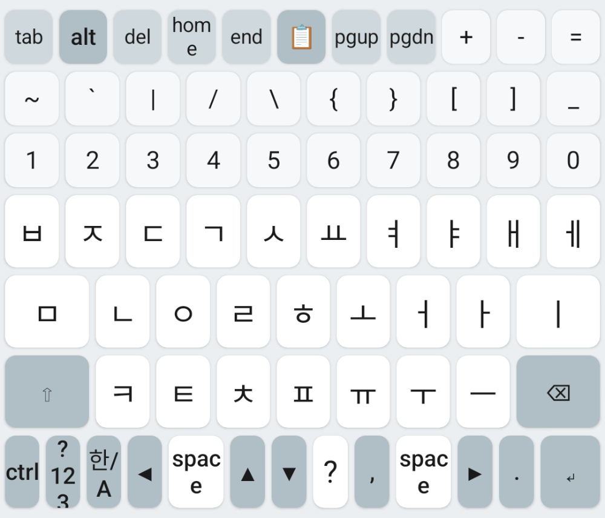
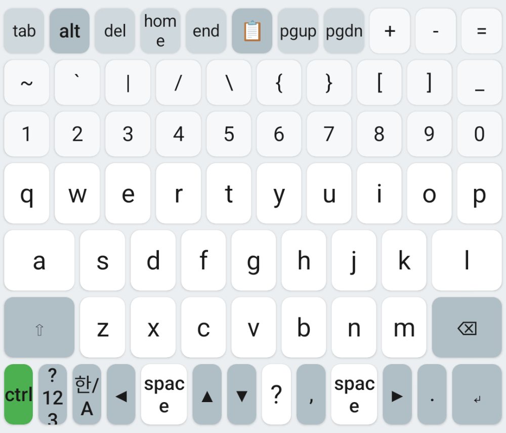
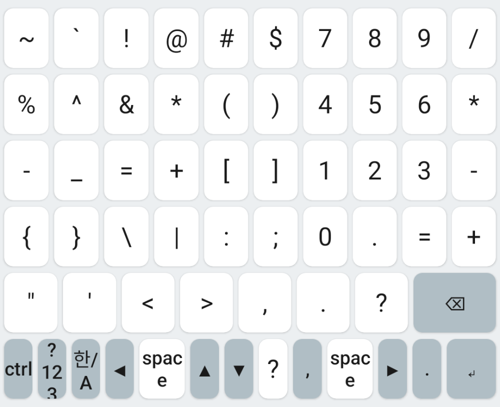
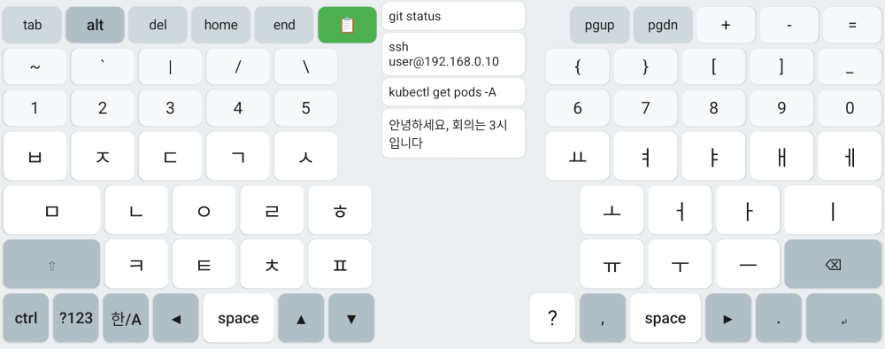
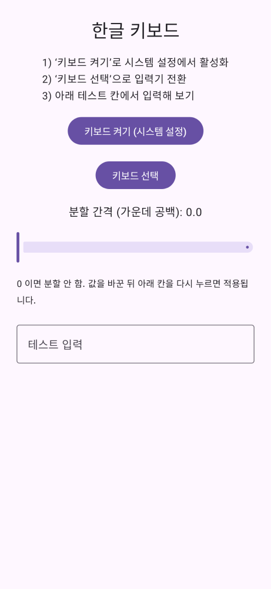

# 한글 개발자 키보드

터미널·코딩·원격 데스크탑용 키를 기본으로 넣은 안드로이드 한글 키보드입니다.



## 설치

1. APK를 설치합니다 (직접 빌드하려면 아래 [빌드](#빌드) 참고).
2. **한글 키보드** 앱 실행 → **키보드 켜기** → 목록에서 켜기
3. **키보드 선택** → 이 키보드로 전환

## 사용법

### 자판

| 줄 | 키 |
|---|---|
| 맨 위 | `tab` `alt` `del` `home` `end` `📋` `pgup` `pgdn` `+` `-` `=` |
| 특수문자 | `` ~ ` \| / \ { } [ ] _ `` |
| 숫자 | `1`~`0` (Shift를 누르면 `!@#…`) |
| 맨 아래 | `ctrl` `?123` `한/A` `◀` `space` `▲` `▼` `?` `,` `space` `▶` `.` `↵` |

- **Shift**: 한 번 누르면 한 글자만, 두 번 누르면 고정
- **방향키·⌫**: 꾹 누르면 반복
- **Shift + ↵**: 전송하지 않고 줄바꿈

### Ctrl / Alt



`ctrl`을 누르면 초록색으로 켜지고, 다음에 누르는 키 하나와 함께 입력됩니다 (`ctrl` → `c` = Ctrl+C).
한글 자판에서도 같은 자리의 영문 키로 동작합니다.

### 기호·숫자패드 (`?123`)



오른쪽 4열이 계산기식 숫자패드입니다.

### 분할 키보드 · 클립보드



- 앱의 **분할 간격** 슬라이더로 가운데를 벌립니다 (0 = 분할 안 함).
- `📋`를 누르면 복사한 기록이 나오고, 누르면 붙여넣어집니다. 분할하지 않았을 때는 키보드 위에 한 줄로 나옵니다.

### 원격 데스크탑

- ⌫, del, 방향키, home/end는 실제 키 입력으로 보내서 원격 PC에서도 동작합니다.
- **한/A를 길게 누르면** 원격 PC의 한/영이 전환됩니다.

### 설정 화면



## 개인정보

인터넷 권한이 없어서 입력한 내용이 밖으로 나가지 않습니다. 클립보드 기록은 메모리에만 있고 키보드가 꺼지면 사라집니다.

## 빌드

```bash
gradle wrapper --gradle-version 8.9   # 처음 한 번
./gradlew assembleDebug               # app/build/outputs/apk/debug/app-debug.apk
```

JDK 17, Android SDK 34가 필요합니다. Android Studio로 열어도 됩니다.

## 라이선스

[MIT](LICENSE)
